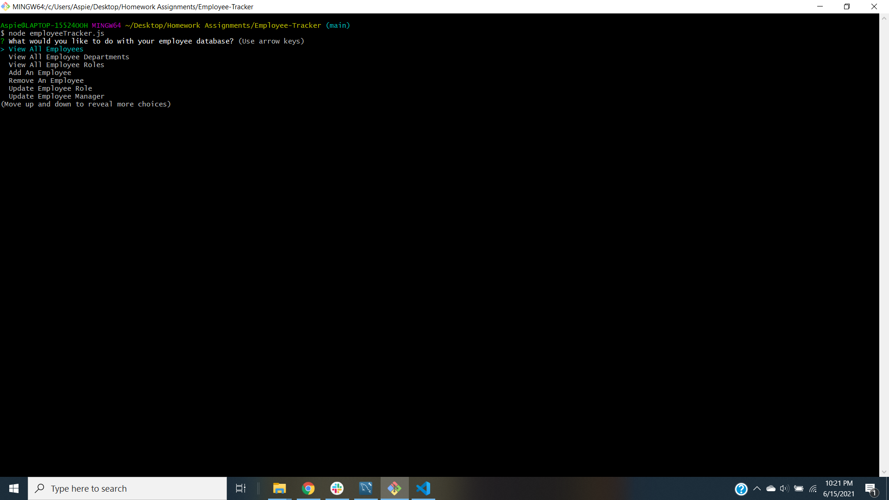
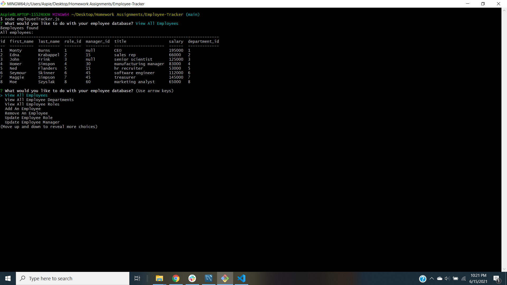

  # **Employee Tracker** :clipboard: :necktie:		
   

  ## Table of Contents :card_file_box:	
   1. [Description](#description)
   2. [Installation](#installation)
   3. [Project Usage](#Project-Usage)
   4. [License Information](#License-Information)
   5. [Contributors](#Project-Contributors)
   6. [Testing Instructions](#Testing-Instructions )
   7. [Future Development](#Future_Developement)
   8. [Contact Info](#Questions)
   9. [Screenshot(s)](#Screenshot(s))
   
  ## Description :open_book:	
  This employee tracker is a Content Management System for managing a company's employees utilizing node, inquirer, and mySQL.

  ## Installation :toolbox:	
  Please follow these steps:
  1. Base files were set up including the installation of the following packages: NPM, Console.Table, mysql and inquirer.
  2. Gitignore file was established to ignore all node modules and DS_Store.
  3. Using mySQL Workbench, an employeetracker_db database was created.  Using the dbSchema and seeds file, employee data was entered and created within 3 tables here.  Info included employee name, id, role id, manager, and salary.
  4. EmployeeTrackerConnection.js file was developed, which established the connection to our local host and database.
  5. Working alongside these files, the employeeTracker.js file was then developed.  The steps included to build out this file were:
      1. Setting up npm dependencies
      2. Establishing a mysql local host connection
      3. Utilizing a const of runTracker, to beging building out the functionality of the backend tracking system.  
      4. Inquirer.prompt was built in to ask user all questions.
      5. Switch statements were also built out to interact correctly user managing the database
      6. View employee, View Department and View Role functions were then built out using queries and JOINS (basic mysql)
      7. Functionality of specific questions were still being tinkered with to function correctly (see future development below).
      8. A exitTracker function was built in last, to exit the app and start over if prompted to.

  ## Project Usage:computer:	
  A backend employee management system which allows for a user to view thier entire staff, roles, salaries, and make edits accordingly to surpervise staff.

  ## License Information
  The MIT License is a permissive free software license originating at the Massachusetts Institute of Technology in the late 1980s. As a permissive license, it puts only very limited restriction on reuse and has, therefore, high license compatibility.

  ## Project Contributors :mechanic:
  Adam Spiegel

  ## Testing Instructions :hammer_and_wrench:	 
  Follow these steps:
  1) Open command line
  2) Navigate to folder hosting files
  3) Begin with node employeeTracker.js
  4) Follow on screen prompts which interact with backend database.
  5) View results in command line for managing your employees.

  ## Future Development :man_technologist:	
  #### Items Still in Development and Troubleshooting:
  1. Deleting departments/roles/employees
  2. Viewing the total utilized budget of all employees
  3. Updating/Viewing employees by manager.

  ## Questions? :thinking:	
  ### Please find my contact information below to reach out! 

      

  ## Application Screenshot(s)

  